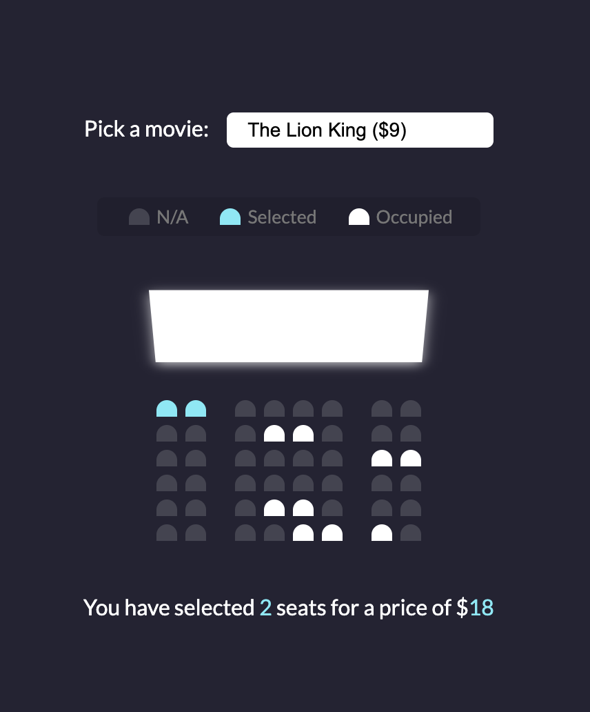

# Movie Seat Booking

A dynamic movie seat booking application built with HTML, CSS, and JavaScript. This project allows users to select seats for a movie, calculates the total price, and provides a visual representation of available, selected, and occupied seats.

Project is deployed at https://movie-seat-booking-eight-rho.vercel.app/.

## Features

- **Movie Selection**: Choose from a list of movies with varying ticket prices.
- **Seat Selection**: Click on available seats to select or deselect them.
- **Occupied Seats**: Predefined occupied seats are visually marked and cannot be selected.
- **Real-Time Updates**: Displays the total number of selected seats and the total price dynamically.
- **Responsive Design**: Works seamlessly across different screen sizes.

## Technologies Used

- HTML
- CSS
- JavaScript

## How to Use

- Clone the repository.
- Open `index.html` in your browser.
- Select a movie and choose your seats to see the total price update in real-time.
